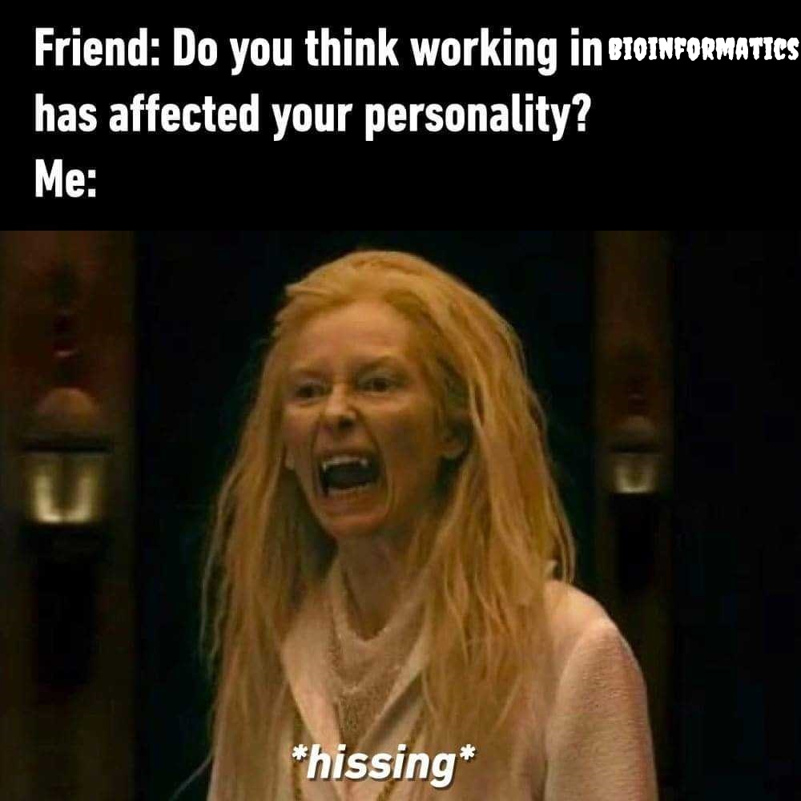

# [Nikos]{style="font-weight:900;"} [Pechlivanis]{style="font-weight:300;"}

ARISE2 Fellow · Software Engineer · Bioinformatics [@]{style="font-weight:300;"} [EMBL-EBI](https://www.ebi.ac.uk/)

::: {style="font-weight:300;text-align:justify"}
Hi! Welcome to my GitHub page. I am a software engineer currently serving as an [ARISE2](https://www.embl.org/training/arise2/) Postodoctoral Fellow within the [Protein Data Bank in Europe (PDBe)](https://www.ebi.ac.uk/pdbe/) team at EMBL's [European Bioinformatics Institute (EMBL-EBI)](https://www.ebi.ac.uk/).

My work focuses on building seamless infrastructure between complex structural biology data and Artificial Intelligence. I am currently working on a project aiming to develop a platform designed to transform natural language queries into high-quality, benchmarked datasets for the scientific community.
:::
<!-- {fig-cap-location="top" fig-align="center" width="50%"} -->

<!-- ::: {style="text-align: center; font-size: .75rem"}
Is that... a FASTA file? Tilda Swinton and Tom Hiddleston from [*Only Lovers Left Alive*](https://www.imdb.com/title/tt1714915/).
::: -->