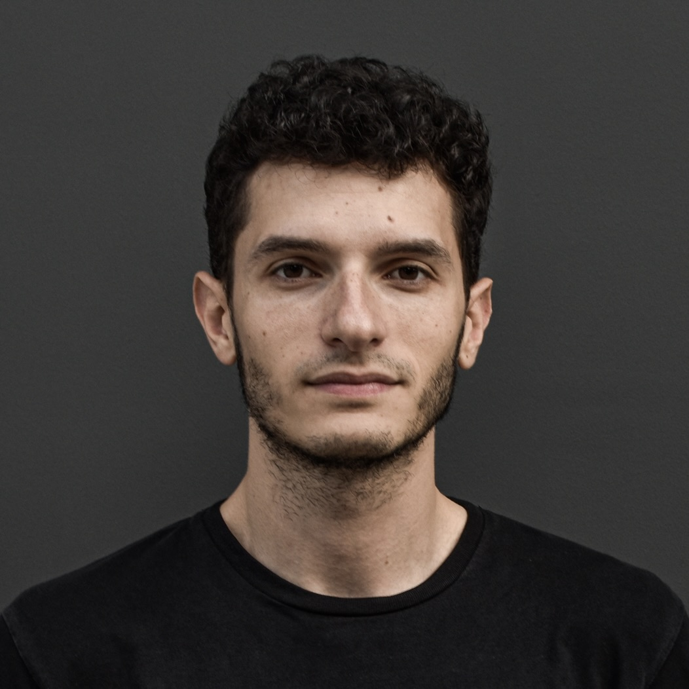

# [Nikos]{style="font-weight:900;"} [Pechlivanis]{style="font-weight:300;"}

ARISE2 Fellow · Software Engineer · Bioinformatics [@]{style="font-weight:300;"}[EMBL-EBI](https://www.ebi.ac.uk/)

:::: {.columns .hero-section}

<!-- ::: {.column width="25%"}
{.hero-image}
:::

::: {.column width="5%"}
::: -->

::: {.column width="100%"}

::: {style="font-weight:300; text-align:justify; margin-top: 0.75em;"}

Hi! Welcome to my GitHub page. I am a software engineer currently serving as an [ARISE2](https://www.embl.org/training/arise2/) Postdoctoral Fellow within the [Protein Data Bank in Europe (PDBe)](https://www.ebi.ac.uk/pdbe/) team at EMBL's [European Bioinformatics Institute (EMBL-EBI)](https://www.ebi.ac.uk/).

My work focuses on building seamless infrastructure between complex structural biology data and Artificial Intelligence. I am currently working on a project aiming to develop a platform designed to transform natural language queries into high-quality, benchmarked datasets for the scientific community.
:::

:::

::::

---

::: {style="margin-top: 0.25em;"}
[Software engineering]{.skill-badge} [Data science]{.skill-badge} [Bioinformatics]{.skill-badge} [Artificial Intelligence]{.skill-badge} [AI-readiness]{.skill-badge} [FAIR Data]{.skill-badge} [Structural biology]{.skill-badge} [Data visualization]{.skill-badge} [Python]{.skill-badge} [R]{.skill-badge} 
:::
